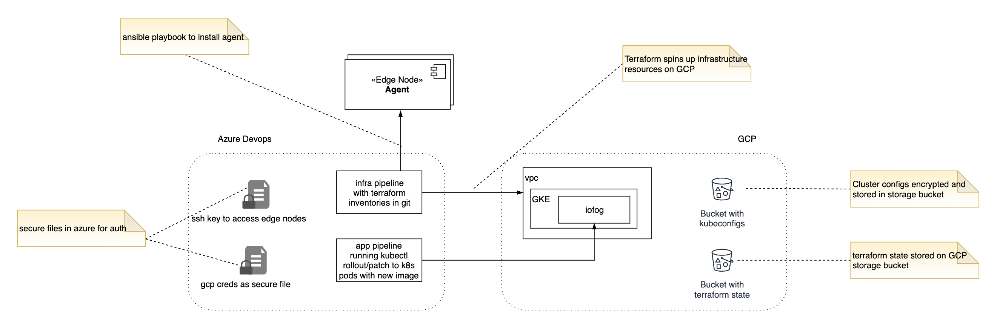

# Deployment
We use Terraform to deploy all infrastructure and ansible to configure remote edge nodes to install agent software.

## Components

The project spins up an infrastructure stack on Google Cloud Platform which consists of:
- vpc 
- subnets & firewall
- gke

Optionally, there is a choice to deploy x86 or arm nodes on Packet.

After the infrastructure setup, iofog ECN is deployed on the GKE cluster using the iofog Helm chart.

Once the control plane is setup, ansible is used to configure edge nodes provided by user as an inventory in the hosts.ini file, and any packet nodes cretaed. Iofog agent software id deployed on these, configured and registerd with the iofog controller in the control plane. 

## Prerequisites

Install tools:
- Terraform (v11*)
- Ansible
- gcloud
- Helm
- Kubectl

Account tokens:
- packet account token exported as an environment variable for packet provider. Command: `export PACKET_AUTH_TOKEN=xxxxx`
- package_cloud account token exported id you are using agent snapshot repo. Command: `export PACKAGE_CLOUD_CREDS=xxxxx`
- gcloud account token to deploy to GCP `export GOOGLE_APPLICATION_CREDENTIALS=path-to-json`

## Usage

As a user, you can switch to the environments_gke directory to find a user folder holding a sample user environment inventory and environment configuration. This configuration does not have a terraform backend, will use local backend to store terraform state files.

In the user directory, run:

1. *terraform init* to initialize your terraform directory
2. *terraform plan -var-file="vars.tfvars"* pass in your vars file
3. *terraform apply -var-file="vars.tfvars" -auto-approve* apply will create your resources
4. *terraform destroy -var-file="vars.tfvars" -auto-approve* use the destroy command to delete all your resources

| Variables              | Description                                                  |
| -----------------------|:------------------------------------------------------------:|
| `project_id`           | *id of your google platform project*                         |
| `environment`          | *unique name for your environment*                           |
| `gcp_region`           | *region to spin up the resources*                            |
| `controller_image`     | *docker image link for controller setup*                     |
| `connector_image`      | *docker image link for connector setup*                      |
| `scheduler_image`      | *docker image link for scheduler setup*                      |
| `operator_image`       | *docker image link for operator setup*                       |
| `kubelet_image`        | *docker image link for kubelet setup*                        |
| `controller_ip`        | *list of edge ips, comma separated to install agent on*      |
| `ssh_key`              | *path to ssh key to be used for accessing edge nodes*        |
| `agent_repo`           | *use `dev` for snapshot repo, else leave empty*              |
| `agent_version`        | *populate if using dev snapshot repo for agent software*     |
| `packet_project_id`    | *packet project id to spin reposrces on packet*              |
| `operating_system`     | *operating system for edge nodes on packet*                  |
| `packet_facility`      | *facilities to use to drop agents*                           |
| `count_x86`            | *number of x86(make sure your project plan allow)*           |
| `plan_x86`             | *server plan for device on x86 available on facility chosen* |
| `count_arm`            | *number of arm sgents to spin up*                            |
| `plan_arm`             | *server plan for device on arm available on facility chosen* |
| `iofogUser_name`       | *name for registration with controller*                      |
| `iofogUser_surname`    | *surname for registration with controller*                   |
| `iofogUser_email`      | *email to use to register with controller*                   |
| `iofogUser_password`   | *password(length >=8) for user registeration with controller*|
    
## Iofoctl for Agent Configuration

If you plan to use snapshot repo, you will need to provide package cloud token, leave it empty if installing released version. 

### Helpful Commands

- Login to gcloud: `gcloud auth login`

- Kubeconfig for gke cluster: `gcloud container clusters get-credentials <<CLUSTER_NAME>> --region <<REGION>>`

- Delete a particular terraform resource: `terraform destroy -target=null_resource.iofog -var-file=vars.tfvars -auto-approve`

- Terraform OUtput `terraform output -module=packet_edge_nodes`